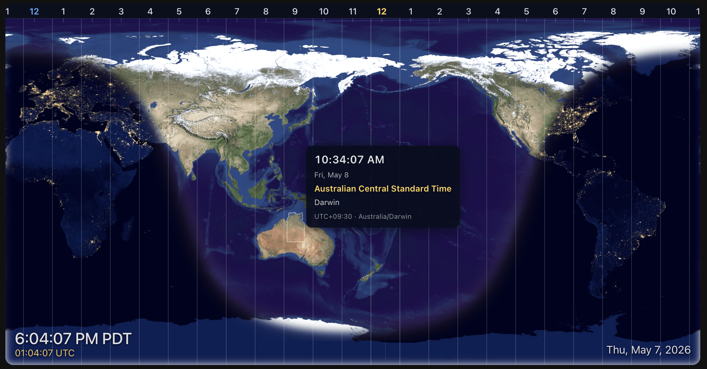

# geo-clock-card

A Home Assistant Lovelace card that turns one of your dashboards into a live
world clock, modeled on the Geochron® style (no affiliation). NASA Blue Marble
(day) and Black Marble (night) imagery, a real day/night terminator computed
from solar geometry, and DST-aware hover popups for every IANA time zone on
the planet.

 <!-- replace once screenshots are captured -->

## What it does

- **World map** — NASA Blue Marble + Black Marble imagery, with the live
  day/night boundary recomputed from the subsolar point. Twelve monthly day
  composites (start + mid of each month, sampled from NASA SVS daily frames)
  swap automatically through the year so vegetation and snow cover follow the
  seasons.
- **Twilight glow** — warm sunrise/sunset rim along the terminator, screen-
  blended over the day side.
- **Hour band** — 25 column meridians at every 15° of longitude, with the
  current local hour highlighted at noon and midnight.
- **Time-zone overlay**:
  - 25 visible 15° offset bands across the globe.
  - 419 invisible IANA polygons on top for hit-testing — hover any country
    and a popup shows DST-aware live time, the long zone name (EDT vs EST
    auto-switches), the offset, and the IANA tzid. Open ocean falls through
    to the offset band's popup.
- **Centering modes** — `antimeridian` (default, dateline at center),
  `home` (your HA-configured longitude), or `sun` (subsolar point — the
  daylit hemisphere stays in the middle and the map slowly drifts).
- **Time scrubbing** — freeze the clock at any UTC moment via `now: …`
  for screenshots or to preview the look at, say, the December solstice.
- **Tunable** — twilight band size, glow color/opacity, day brightness,
  night contrast, all via card config or CSS variables.
- **Cheap** — clock readout ticks every second; the map only recomputes
  when the subsolar point would have moved ≥ 0.5 px on a 4K display
  (≈ every 10.5 s).

## Install

### HACS (recommended)

1. HACS → ⋮ → **Custom repositories** → add `https://github.com/jpettitt/geo-clock-card`,
   category **Lovelace**.
2. Install **Geo Clock Card** from HACS.
3. Refresh the browser. HACS adds the resource for you; otherwise:
   Settings → Dashboards → ⋮ → **Resources** → add
   `/hacsfiles/geo-clock-card/geo-clock-card.js` as a **JavaScript Module**.
4. Add a card to your dashboard:

   ```yaml
   type: custom:geo-clock-card
   ```

### Manual

1. Clone the repo and build:

   ```bash
   git clone https://github.com/jpettitt/geo-clock-card
   cd geo-clock-card
   npm install
   npm run fetch-assets   # downloads NASA imagery + IANA TZ polygons
   npm run build
   ```

2. Copy the entire `dist/` directory into your Home Assistant config:

   ```text
   <config>/www/community/geo-clock-card/
       geo-clock-card.js
       blue-marble-*-2048.jpg
       black-marble-2048.jpg
       timezones.json
       timezones-iana.json
   ```

3. Add the resource:
   Settings → Dashboards → ⋮ → **Resources** →
   `/local/community/geo-clock-card/geo-clock-card.js`, type **JavaScript Module**.
4. Add the card with `type: custom:geo-clock-card`.

## Configuration

A visual editor opens automatically when you add the card from the Lovelace
picker. Every option is also settable in YAML:

```yaml
type: custom:geo-clock-card

# Map centering — sun (default) | home | longitude | entity
center: sun
centerLongitude: -119       # required when center: longitude. -180..180.
centerEntity: zone.home     # required when center: entity. Must expose a longitude attribute.
showHomeMarker: false       # render a dot at hass.config.latitude/longitude

# Imagery + atmosphere
dayBrightness: 1.15         # CSS brightness() on the day layer (0.5..2.0)
nightContrast: 1.0          # CSS contrast() on the night layer (0.5..3.0)
twilightDegrees: 8          # half-band of the day/night fade, sun-elevation degrees (1..18)
twilightColor: "#463701"    # hex / rgb / rgba / hsl / named color
twilightOpacity: 0.26       # 0..1

# Time
updateInterval: 1           # seconds between clock-readout ticks (1..600).
                            # The map repaints on a separate auto-throttled timer.
now: "2024-12-21T09:21:00Z" # freeze the clock at this moment (omit for live)

# Overlays
showTimezoneBand: true      # hour-of-day numbers across the top
showTimezoneBoundaries: true # offset bands + IANA hover popups
showUTC: true               # UTC time below the local clock

# Bundle resolution (rarely needed; not exposed in the visual editor)
imageryBase: ""             # override the assets URL (e.g. host on a CDN)
```

### Centering modes

- **`sun`** (default) — centered on the current subsolar longitude. The map
  drifts westward as the sun moves; the daylit hemisphere stays in the middle.
- **`home`** — centered on `hass.config.longitude`. Falls back to `sun` if HA
  hasn't reported a location.
- **`longitude`** — centered on a numeric `centerLongitude` value.
- **`entity`** — centered on the longitude attribute of an HA entity. Works
  with `zone.*`, `person.*`, and most `device_tracker.*` entities. Falls back
  to `sun` if the entity is missing or has no longitude.

### Theme via CSS variables

The card respects HA dashboard themes via custom-element CSS variables. Drop
these in your theme YAML (or use `card-mod`) to override without touching the
card config:

```yaml
geo-clock-card:
  --geo-day-brightness: 1.2
  --geo-night-contrast: 1.0
  --geo-twilight-color: "#5a4a1a"
  --geo-twilight-opacity: 0.3
  --geo-tz-bg: rgba(8, 14, 28, 0.85)
  --geo-tz-noon: "#ffd866"
  --geo-tz-mid: "#6ab0ff"
  --geo-tz-line: rgba(255, 255, 255, 0.45)
```

## Imagery sources (all public domain)

| Layer | Source | Resolution |
| --- | --- | --- |
| Day (Blue Marble) | NASA SVS dataset 3523, daily frames interpolating monthly Blue Marble Next Generation composites | 2048 × 1024 JPEG, 24 frames (start + mid of each month) |
| Night (Black Marble) | NASA "Earth at Night" 2012 composite | 2048 × 1024 JPEG |
| Time-zone offsets | Generated as 25 × 15° rectangle bands | 8 KB GeoJSON |
| Time-zone IANA | [timezone-boundary-builder](https://github.com/evansiroky/timezone-boundary-builder) 2026b, simplified to 1% retention | ~960 KB GeoJSON |

## Develop

```bash
npm install
npm run fetch-assets    # one-time: pulls + resizes imagery, downloads + simplifies TZ data
npm test                # vitest — solar math, projection, polygon, IANA helpers
npm run build           # rollup → dist/geo-clock-card.js + copies assets
npm run dev             # rollup --watch
```

A standalone preview lives at [`dev/index.html`](dev/index.html). Run a static
server from the repo root (`python3 -m http.server 8765`) and open
<http://localhost:8765/dev/index.html>. The preview gives you sliders for
twilight band, day brightness, night contrast, twilight color/opacity,
center mode, time-scrubbing with solstice/equinox presets, etc.

## How the pieces fit together

- [`src/sun.ts`](src/sun.ts) — subsolar point + sun-elevation math (USNO low-precision formulas).
- [`src/terminator.ts`](src/terminator.ts) — terminator polygon and curve, parameterized by center longitude.
- [`src/projection.ts`](src/projection.ts) — equirectangular projection with arbitrary center.
- [`src/timezones.ts`](src/timezones.ts) — offset overlay (25 rectangle bands + popup data).
- [`src/timezones-iana.ts`](src/timezones-iana.ts) — IANA polygon hit-testing layer + DST-aware `Intl.DateTimeFormat` wrapper.
- [`src/timezone-band.ts`](src/timezone-band.ts) — top-of-map hour band + tick lines.
- [`src/day-image.ts`](src/day-image.ts) — picks the right monthly daylight image for a given date.
- [`src/geo-clock-card.ts`](src/geo-clock-card.ts) — the Lit element that wires it all together.

The original design notes are in [`DESIGN.md`](DESIGN.md).

## License

MIT for the code. NASA imagery is public domain. timezone-boundary-builder
data is ODbL.

Geochron® is a registered trademark of Geochron Enterprises Inc.; this
project is not affiliated with or endorsed by them.
